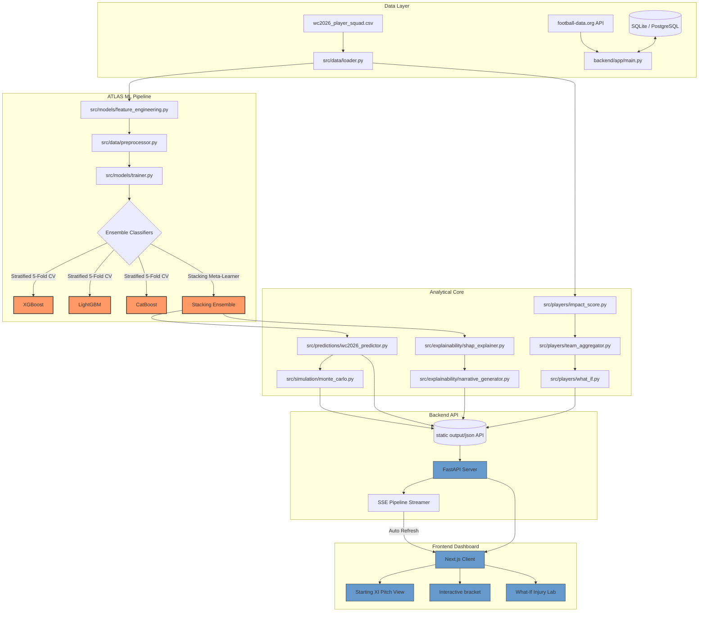

# ⚽ TournAI × ATLAS: Football Intelligence Platform

### *Tournament Intelligence, Continuously Learning.*

[](https://www.python.org/)
[](https://fastapi.tiangolo.com/)
[](https://nextjs.org/)
[](https://scikit-learn.org/)
[](https://shap.readthedocs.io/)
[](https://xgboost.readthedocs.io/)
[](https://lightgbm.readthedocs.io/)
[](https://catboost.ai/)
[](https://opensource.org/licenses/MIT)

**TournAI** is a state-of-the-art, adaptive football forecasting and tournament intelligence platform designed for the **FIFA World Cup 2026**. Powered by the **ATLAS (Adaptive Tournament Learning and Analytics System)** engine, TournAI departs from traditional "static" forecasting. Instead of printing a single set of predictions before kickoff, the model continuously learns, updates player impact ratings, adjusts ELO standings, and runs large-scale Monte Carlo tournament simulations in real time as each match completes.

---

## 🧠 System Architecture Overview

ATLAS uses a decoupled, modular design combining a Python ML pipeline, a FastAPI backend hosting live-updating SQLite/PostgreSQL schemas, and a responsive Next.js frontend featuring rich glassmorphism visual aesthetics.



---

## 🔬 Core Machine Learning Engineering

### 1. Feature Engineering
ATLAS processes raw team and player data into standard, model-ready features. The primary feature set `FINAL_FEATURES` includes:
*   **`elo_diff`**: Current Elo difference between the match competitors.
*   **`elo_win_prob`**: Direct Elo probability projection computed via logistic curves.
*   **`form_diff`**: Rolling exponential-decay form indicator of both teams.
*   **`squad_quality_diff`**: Aggregated differential of player impact ratings.
*   **`experience_diff` & `pedigree_diff`**: Historic team performance metrics and squad World Cup caps.
*   **`club_prestige_diff`**: Weighted league/club tier multiplier for starting squad players.

### 2. Multi-Class Stacking Ensembles
The model categorizes outcomes into three distinct classes: **Home Win (2)**, **Draw (1)**, and **Away Win (0)**. The trainer module ([trainer.py](file:///e:/AKiB's%20Project%20Book/TournAI-x-ATLAS-codebase/src/models/trainer.py)) fits and cross-validates 7 classifiers, including:
1.  **XGBoost**: Tuned for high feature interaction bounds.
2.  **LightGBM**: Fast histogram-based gradient booster utilizing class-balanced weights.
3.  **CatBoost**: Handles categorical bounds natively, optimized using symmetric trees.
4.  **Voting Ensemble**: Soft voting using probabilities from XGBoost, LightGBM, and CatBoost.
5.  **Stacking Classifier**: Learns optimal combinations of base tree classifiers using a L2-penalized Logistic Regression meta-learner.

### 3. SHAP Explainable AI (XAI)
To demystify predictions, the system uses [shap_explainer.py](file:///e:/AKiB's%20Project%20Book/TournAI-x-ATLAS-codebase/src/explainability/shap_explainer.py). For every match, ATLAS calculates SHAP values relative to the winning class. The [narrative_generator.py](file:///e:/AKiB's%20Project%20Book/TournAI-x-ATLAS-codebase/src/explainability/narrative_generator.py) translates the top 3 SHAP variables into user-facing sentences:
> *"Squad quality difference increases win chance by 14.5%"*  
> *"Recent form trend decreases win chance by 3.2%"*

---

## 📈 Player & Team Intelligence

### 1. Player Impact Score
We compute a unified Player Impact Score (0–100 scale) for all tournament players based on position-adjusted metrics:
$$\text{Impact Score} = \sum (w_i \times \text{Normalize}(Metric_i))$$
*   **Weights Layout**: Expected Goals ($xG_{p90}$): **20%**, Goals ($Goals_{p90}$): **15%**, Key Passes ($KP_{p90}$): **15%**, Interceptions ($Int_{p90}$): **10%**, Progressive Carries: **10%**, Pass Accuracy: **10%**, Dribble Success: **5%**, Recent Minutes: **15%**.

### 2. Dynamic Team Rosters & Pitch Layout
When the user clicks a country, the platform renders a soccer pitch with a **4-3-3 formation** (1 Goalkeeper, 4 Defenders, 3 Midfielders, 3 Forwards) utilizing:
*   **Dynamic Squad Partitioning**: Automatically assigns players to their best roles relative to squad metrics (e.g., sorting by interceptions for defenders). This guarantees a complete Starting XI even for teams lacking deep stats.
*   **Wikipedia Headshot Integration**: Connects to the free Wikipedia PageImages API client-side with CORS enabled to resolve profile headshots. Images are doubly-cached in memory and the browser's `localStorage` for latency-free subsequent loads.

### 3. "What-If" Injury Laboratory
Simulates hypothetical outcomes. If a key player is marked "injured", the engine:
1. Re-calculates the national squad’s aggregated stats.
2. Subtracts their player impact score from the team overall rating.
3. Simulates the tournament bracket under the updated team configurations.

---

## ⚙️ Backend API Architecture

The FastAPI server ([main.py](file:///e:/AKiB's%20Project%20Book/TournAI-x-ATLAS-codebase/backend/app/main.py)) handles match ingestion, live ratings, user bracket entries, and leaderboards.

### Key Endpoints
*   `GET /api/predictions`: Returns fixture forecasts enriched with Poisson-computed scores, Shannon Entropy-based confidence, and upset indicators.
*   `GET /api/simulations`: Outputs Monte Carlo tournament bracket probabilities.
*   `GET /api/players`: Returns player stats and aggregate team metrics.
*   `GET /api/explanations`: Accesses SHAP global importance data and local match narratives.
*   `GET /api/sse/pipeline`: Server-Sent Events stream. The frontend stays open to this endpoint; when a match finishes and the ATLAS training pipeline finishes running, it triggers a reactive UI refresh.

---

## 📁 Repository Structure

```text
├── .vscode/                 # Editor and Linting Configurations
├── Dataset/                 # Raw/Processable Player and Squad CSV files
├── backend/                 # FastAPI REST Engine
│   └── app/
│       ├── db/              # SQLAlchemy schemas, SQLite tables, and CRUD utilities
│       ├── tasks/           # Celery workers for async adaptive pipeline triggers
│       └── main.py          # FastAPI application routes & background sync thread
├── frontend/                # Next.js 14 Client App
│   ├── public/
│   │   └── images/          # Country flags, brand logos, and UI backgrounds
│   └── src/
│       ├── app/             # Bracket, Injury Lab, and Prediction routes
│       └── components/      # UI Elements (Navbar, Footer, PlayerImage)
├── src/                     # Modular ATLAS Engine Source
│   ├── adaptive/            # ELO recalculation, automated model retraining triggers
│   ├── data/                # Data loaders and min-max scalers
│   ├── explainability/      # SHAP explainers and narrative translation algorithms
│   ├── models/              # Feature engineering, Stacked Ensemble training, metrics
│   ├── players/             # Impact scoring logic, roster aggregations, injury labs
│   ├── predictions/         # 2026 outcome models, group standings calculation
│   └── simulation/          # Large-scale Monte Carlo tournament simulation
├── run_atlas_pipeline.py    # Main training and simulation execution pipeline script
├── requirements.txt         # Backend Python Dependencies
└── package.json             # Next.js Node Dependencies
```

---

## 🚀 Getting Started

Follow these instructions to run the entire backend, model training pipeline, and frontend dashboard locally.

### Prerequisites
*   Python 3.10+
*   Node.js v18+
*   Git

### 1. Set Up the Backend
1. Clone the repository and navigate to the project directory:
   ```bash
   git clone https://github.com/HippomasAKiB1/TournAI-x-ATLAS-codebase.git
   cd TournAI-x-ATLAS-codebase
   ```
2. Create and activate a Python virtual environment:
   ```bash
   python -m venv venv
   # On Windows:
   .\venv\Scripts\activate
   # On macOS/Linux:
   source venv/bin/activate
   ```
3. Install required packages:
   ```bash
   pip install -r requirements.txt
   ```
4. Start the FastAPI backend server:
   ```bash
   uvicorn backend.app.main:app --host 127.0.0.1 --port 8000 --reload
   ```
   *The database schema (SQLite) is initialized and populated with World Cup schedules automatically on startup.*

### 2. Execute the ATLAS Training & Simulation Pipeline
Before running the dashboard, execute the modular machine learning pipeline. This loads datasets, trains the tree-based stacking classifiers, saves serialized models, calculates SHAP explanations, runs a 10,000-iteration Monte Carlo simulation, and exports static JSON configurations for the UI:
```bash
python run_atlas_pipeline.py
```
Outputs are written directly to `output/models/`, `output/results/`, and synced with the frontend in `frontend/public/data/`.

### 3. Set Up the Frontend
1. Navigate to the frontend directory:
   ```bash
   cd frontend
   ```
2. Install package dependencies:
   ```bash
   npm install
   ```
3. Start the Next.js development server:
   ```bash
   npm run dev
   ```
4. Open [http://localhost:3000](http://localhost:3000) in your browser.

---

## 🏆 Model Performance Goals & Metrics

ATLAS tracks performance metrics to evaluate prediction strength over baseline algorithms:

| Performance Metric | Target | Description |
|---|---|---|
| **Match Outcome Accuracy** | `>70%` | Exact match outcomes (Win/Draw/Loss) correctly predicted |
| **Brier Score** | `<0.18` | Measures the accuracy of probability forecasts |
| **Top 3 Champion Probability** | `>90%` | Real champion is included in our top 3 Monte Carlo outcomes |
| **Daily Return Rate** | `>40%` | Frequency of user visits during live tournaments |

---

## 🤝 Authors & Contributors

*   **AKiB** ([@HippomasAKiB1](https://github.com/HippomasAKiB1)) — Lead Developer & Architect.
*   **Antigravity** (AI Assistant by Google DeepMind) — Pair Programmer.


*Feel free to submit a pull request or open an issue to enhance the models or add UI features!*